# 📈 Financial Analyst Agent — Tool-Augmented RAG with LangGraph


-red)


## 🎥 Project Demo
> Short demos showcasing retrieval, tool-based computation, and multi-turn reasoning.

### 1) Core Capability: RAG + Precision Math (Tool-Enforced)
**Scenario:** Query Apple's 2024 Form 10-K (retrieval), then do a forward-looking projection based on retrieved net sales.

▶️ Demo:
https://github.com/denis7-jean/Financial-Analyst-Agent-RAG-LangGraph/releases/download/v1.0/demo_rag_calculation.mp4

### 2) Multi-turn Context: Follow-up Without Re-retrieval
**Scenario:** Compare the projected net sales against Apple's 2023 historical data using prior context.

▶️ Demo:
https://github.com/denis7-jean/Financial-Analyst-Agent-RAG-LangGraph/releases/download/v1.0/demo_multiturn_comparison.mp4

---

### 3) Cross-Domain Tool Synergies (RAG + Web + Math)
**Scenario:** The user queries Apple's 2024 Form 10-K for net sales, requests current stock prices from live markets, and asks for a custom ratio calculation.
The agent seamlessly transitions across three tools: extracting accurate 10-K figures via Hybrid RAG, fetching real-time market data via `yfinance`, and computing the ratio via a deterministic `calculator` tool without mental math hallucinations.

### 4) Traceability & Artifact Debugging
**Scenario:** Inspecting the underlying data pipeline.
The project includes a dedicated `eval_ui.py` Streamlit dashboard to visually trace parsed HTML tables, chunk metadata (page/section), and Hybrid Search (Dense + Sparse) fusion scores.

---

## 📖 Project Overview
This project is an advanced **Agentic RAG System** designed to perform autonomous analysis of financial documents (SEC 10-K filings).

Unlike traditional RAG pipelines that simply retrieve flattened text, this system uses **Hi-Res Document Parsing** to keep financial tables intact, orchestrates a **Multi-Stage Hybrid Retrieval** engine with Reciprocal Rank Fusion, and uses **LangGraph** to power an explicit state-machine workflow. The agent dynamically routes between RAG, real-time web search, and deterministic math evaluation — with structured cell-level evidence selection to eliminate table misalignment errors.

### 🎯 Objective
To solve the "hallucination" and "math" problems in financial LLM applications by decoupling **retrieval**, **reasoning**, and **calculation**, while ensuring 100% citation traceability.

---

## 🧠 Architectural Evolution

### Phase 1: From ReAct to Explicit Routing
Initially built using a standard ReAct loop (where the LLM freely decides when/if to call tools), the agent struggled with implicit questions and often hallucinated math or fell back to conversational clarification.

The architecture was upgraded from **Soft Constraints (Prompt Engineering)** to **Hard Constraints (Graph Edges)**:
- **Explicit Router:** A structured output node categorizes the query, forcing the agent down a specialized execution path.
- **Math Prep Pipeline:** By decoupling extraction (`math_prep_node`) from computation (`calculator_node`), the agent is strictly prohibited from performing "mental math", completely eliminating arithmetic hallucinations.

### Phase 2: Precision Retrieval & Cell-Level Evidence (Current)
The system was further upgraded to address the core bottleneck identified in evaluation: **row/column misalignment in dense SEC tables**.

Key upgrades across 4 sprints:
- **Filing route split** into `filing_financial` and `filing_narrative` — narrative questions no longer run through the financial audit pipeline
- **Cell-level extraction pipeline** — `cell_plan_node` pre-selects exact table cells using rule-assisted row matching before the LLM reads any table
- **Multi-stage hybrid retrieval** — RRF fusion over dense + sparse results with query expansion, deduplication, and gentle metadata-aware reranking
- **Targeted retry** — `revision_plan_node` diagnoses audit failures by type (row_mismatch, year_mismatch, citation_mismatch, insufficient_context) and routes to the correct recovery node
- **Row-level artifacts** — `table_rows.jsonl` enables deterministic row pre-selection without re-parsing HTML at query time

### Current Architecture

```mermaid
graph TD
    A[User Query] --> B(router_node: Intent Classification)

    B -- "filing_financial" --> C[filing_financial_node: Hybrid Search]
    B -- "filing_narrative" --> D[filing_narrative_node: Hybrid Search]
    B -- "market" --> E[market_node: yfinance]
    B -- "news" --> F[news_node: Tavily]
    B -- "general" --> K

    C --> G{Requires Math?}
    G -- "Yes" --> H[cell_plan_node: Select Exact Cells]
    G -- "No" --> K

    H -- "confidence=high" --> I[math_prep_node: Build Expression]
    H -- "confidence!=high" --> K

    I --> J[calculator_node: Deterministic Arithmetic]
    J --> K[draft_answer_node: Generate Answer]

    D --> K
    E --> K
    F --> K

    K --> L{Audit}
    L -- "filing_financial" --> M[financial_audit_node]
    L -- "filing_narrative" --> N[narrative_audit_node]
    L -- "other" --> O[END]

    M -- "pass" --> O
    M -- "fail" --> P[revision_plan_node: Diagnose Failure]
    N -- "pass" --> O
    N -- "fail" --> P

    P -- "row/year mismatch" --> H
    P -- "citation mismatch" --> K
    P -- "insufficient context" --> C
```



---

## 📊 LLMOps & Evaluation (LangSmith)

This project uses **LangSmith** for full-lifecycle observability with a 4-dimension evaluation framework.

### Evaluation Results — Test Run 11

8 test cases evaluated against Apple's 2024 Form 10-K:

| Question | Expected | Agent Answer | Route ✓ | Retrieval ✓ | Cell ✓ | Answer ✓ |
|----------|----------|--------------|---------|-------------|--------|----------|
| Total net sales 2024 | 391,035 | $391,035 (page 32) ✅ | ✅ | ✅ | ✅ | ✅ |
| Net sales 2023 + YoY diff | 383,285 / 7,750 | 383,285 + 7,750 higher ✅ | ✅ | ✅ | ✅ | ✅ |
| 5% projection on 2024 sales | 410,586.75 | 410,586.75 ✅ | ✅ | ✅ | ✅ | ✅ |
| Net income 2024 | 93,736 | $93,736M (page 32) ✅ | ✅ | ✅ | ✅ | ✅ |
| Competition risks section | Risk Factors | Risk Factors (page 6) ✅ | ✅ | ✅ | N/A | ✅ |
| Major business risks section | Risk Factors | Part I, Item 1A, Risk Factors ✅ | ✅ | ✅ | ✅ | ✅ |
| Gross margin 2024 | 180,683 | Could not retrieve ❌ | ✅ | ❌ | ❌ | ❌ |
| Cash flow from operations 2024 | 118,254 | Found page, no value ❌ | ✅ | ✅ | ❌ | ❌ |

**Aggregate scores across 8 questions:**

| Dimension | Score | Description |
|-----------|-------|-------------|
| `route_correct` | **8 / 8 — 100%** | Router correctly classified all queries |
| `retrieval_support_present` | **6 / 8 — 75%** | Citation present in answer |
| `cell_selection_correct` | **5 / 8 — 63%** | Correct numeric values extracted |
| `final_answer_correct` | **6 / 8 — 75%** | End-to-end correct answer |

### Memory & Routing Verification (Manual)
| Query | Expected Behavior | Result |
|-------|-------------------|--------|
| "What were Apple's net sales in 2024?" | Retrieve from 10-K | $391,035 ✅ |
| "How does that compare to 2023?" | Use memory, no re-retrieval | 383,285 from prior context ✅ |
| "What's the current stock price of AAPL?" | Route to market_node → yfinance | $247.99 ✅ |

### Interpreting the Results

**Strengths confirmed by evaluation:**
- **Routing is perfect (100%)** — the explicit router never misclassifies query intent, confirming that hard graph constraints outperform ReAct loops for structured financial QA.
- **Math pipeline is fully reliable** — all questions requiring arithmetic (projection, YoY comparison) returned exact correct values. The `calculator` tool eliminates hallucinated arithmetic entirely.
- **Net income and net sales extracted correctly** — the `cell_plan_node` + `_match_target_row()` pipeline successfully navigated the Consolidated Statements of Operations table.

**Known gaps revealed by evaluation:**
- **Gross margin and cash flow retrieval failures** — these metrics appear in different statement tables (Balance Sheet / Cash Flow Statement) that were not retrieved in the top-k results for these queries. This is a retrieval coverage issue, not a table extraction issue. Addressed in future work with `expand_neighbor_context()`.
- **The 4-dimension framework pinpoints failures precisely** — `route_correct=1, retrieval_support=0` immediately isolates retrieval as the bottleneck, without ambiguity about whether routing or math caused the failure.

---

## ✨ Key Features & Technical Capabilities

### 1. Table-Aware RAG Engineering
- **Hi-Res Parsing:** Uses `unstructured` with `hi_res` strategy and `infer_table_structure=True` to preserve financial tables as structured HTML, converted to aligned text format.
- **Row-Level Artifacts:** `table_rows.jsonl` stores one record per table row with normalized labels, enabling deterministic row pre-selection without re-parsing at query time.
- **Rich Metadata:** Every chunk carries `chunk_id`, `source`, `page`, `section`, `chunk_kind`, `table_headers`, `year_headers`, `first_column_candidates`, and `table_row_count`.

### 2. Multi-Stage Hybrid Retrieval Engine
- **Query Expansion:** Deterministic variants (lowercase, punctuation-normalized, keyword-heavy financial query) improve recall without semantic noise.
- **RRF Fusion:** Reciprocal Rank Fusion (K=20) combines dense (ChromaDB MMR) and sparse (local BM25 with IDF + length normalization) results across all query variants.
- **Gentle Reranking:** Metadata-aware boost signals (year match, table_aligned chunk kind, section relevance, metric overlap) applied after fusion — boost-only, never hard-filters.
- **Debug Diagnostics:** `return_debug=True` exposes `expanded_queries`, `candidate_counts`, and per-document `dense_rank / sparse_rank / fused_score / rerank_boost_reason` for LangSmith tracing.

### 3. Cell-Level Evidence Pipeline
- **`_match_target_row()`:** Rule-based row pre-selection using metric synonym mapping (`METRIC_SYNONYMS`) before any LLM reads the table. Scores rows by exact match (+3), substring (+2), synonym (+1).
- **`cell_plan_node`:** LLM selects exact cells from pre-filtered row candidates using `CellPlan` / `SelectedCell` schemas. Only proceeds to calculator when `confidence == "high"`.
- **`revision_plan_node`:** Diagnoses audit failures by type and routes retries to the correct node — row/year mismatch goes back to `cell_plan_node`, insufficient context triggers wider retrieval.

### 4. LangGraph Explicit Routing
- **5 routes:** `filing_financial`, `filing_narrative`, `market`, `news`, `general`
- **Separate audit paths:** `financial_audit_node` (strict numeric verification) and `narrative_audit_node` (citation and section grounding only)
- **All LLM calls** use `with_structured_output(PydanticSchema)` — no free-form outputs in routing or planning steps

### 5. Persistent Conversational Memory (LangGraph)
- **Thread-level short-term memory:** Uses `MemorySaver` as the graph checkpointer — every message, retrieval result, and calculator output is persisted per conversation thread, enabling genuine multi-turn context without re-retrieval.
- **Cross-thread long-term memory:** Uses `InMemoryStore` — architecture is ready for user-level persistent facts across sessions.
- **Session isolation:** Each browser session receives a unique `thread_id` (UUID generated via `st.session_state`) — conversations are fully isolated between tabs and users.
- **Verified behavior:** Follow-up queries like "How does that compare to 2023?" correctly resolve using prior context without triggering a new retrieval call.

---

## 🛠️ Tech Stack

| Layer | Technology |
|-------|-----------|
| Orchestration | LangChain, LangGraph |
| LLM | Google `gemini-2.0-flash` |
| Embeddings | Google `text-embedding-004` |
| Vector DB | ChromaDB (Dense, MMR) |
| Sparse Retrieval | Local BM25 (IDF + length norm, self-contained) |
| Fusion | Reciprocal Rank Fusion (RRF, K=20) |
| Document Parsing | `unstructured` (Tesseract OCR + Poppler, hi_res) |
| Agent Tools | `yfinance`, `tavily-python`, `numexpr`, `simpleeval` |
| Observability | LangSmith (4-dimension evaluation) |
| Memory | LangGraph `MemorySaver` (thread) + `InMemoryStore` (cross-thread) |
| Frontend | Streamlit |

---

## 📂 Project Structure

```bash
├── data/                        # Raw 10-K PDFs
├── vector_db/                   # ChromaDB + JSONL artifacts
│   ├── chunks.jsonl             # All chunks (text + table_aligned)
│   ├── table_rows.jsonl         # Row-level table artifact for rule-based matching
│   └── artifacts/
│       ├── parsed_elements.jsonl
│       └── ingestion_summary.json
├── src/
│   ├── config.py                # Centralized env vars and paths
│   ├── ingestion/
│   │   └── ingest.py            # Hi-res PDF parsing, chunking, embedding, artifact generation
│   ├── retrieval/
│   │   └── retrieval.py         # Multi-stage hybrid retrieval (BM25 + dense + RRF + rerank)
│   ├── graph/
│   │   └── graph.py             # LangGraph nodes, routing, cell pipeline, audit, retry
│   ├── tools/
│   │   └── tools.py             # search_10k, yfinance_tool, calculator, web_search
│   └── evaluation/
│       └── evaluate_langsmith.py # 4-dimension LangSmith evaluation
├── tests/
│   ├── test_ingest.py
│   └── test_retrieval.py
├── app.py                       # Streamlit chat UI
├── eval_ui.py                   # Debug UI for artifact tracing and retrieval scores
├── conftest.py                  # pytest path setup
├── requirements.txt
├── Dockerfile                   # Cloud Run ready
└── README.md
```

---

## 🚀 Getting Started

### 1. Environment Setup

```bash
conda create -n financial_agent python=3.10
conda activate financial_agent
pip install -r requirements.txt
```

System-level dependencies (Linux/Docker):
```bash
apt-get install poppler-utils tesseract-ocr libmagic-dev
```

### 2. Configuration

Create a `.env` file in the project root:

```env
GOOGLE_API_KEY=AIzaSy...
TAVILY_API_KEY=tvly-...
GEMINI_MODEL=gemini-2.0-flash
EMBED_MODEL=text-embedding-004

# LangSmith (optional but recommended)
LANGCHAIN_TRACING_V2=true
LANGCHAIN_ENDPOINT=https://api.smith.langchain.com
LANGCHAIN_API_KEY=lsv2_...
LANGCHAIN_PROJECT=Financial-Analyst-Agent
```

### 3. Ingest

Place 10-K PDFs in `data/`, then:

```bash
python -m src.ingestion.ingest
```

This writes ChromaDB, `chunks.jsonl`, `table_rows.jsonl`, and ingestion artifacts to `vector_db/`.

### 4. Run Tests

```bash
pytest tests/
```

### 5. Evaluate

```bash
python -m src.evaluation.evaluate_langsmith
```

### 6. Launch the Agent

```bash
streamlit run app.py
```

### 7. Debug Retrieval

```bash
streamlit run eval_ui.py
```

---

## 🔮 Future Work

- **Text2SQL over `table_rows.jsonl`** — deterministic cell lookup by row label + year, eliminating LLM table reading entirely for exact-value queries
- **Multi-document support** — ingest multiple 10-Ks and route by company/year
- **Vision-Language parsing** — VLM-based table extraction for tables where aligned-text conversion loses structure
- **Expand neighbor context** — automatically supplement top retrieval results with adjacent narrative chunks for better citation grounding on cross-statement queries

---

*Author: Huiyao Lan — MEng, Data Analytics and Machine Learning*