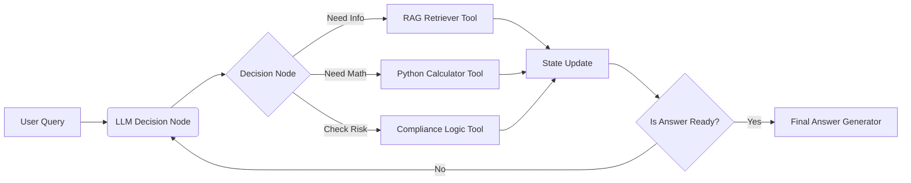

# 📈 Financial Analyst Agent — Tool-Augmented RAG with LangGraph

## 🎥 Project Demo

> 30-second demos showcasing retrieval, tool-based computation, and multi-turn reasoning.

### 1. Core Capability: RAG + Precision Math
**Scenario:** The user queries Apple’s 2024 Form 10-K risk factors (retrieval), then requests a forward-looking projection based on 2024 net sales.

The agent retrieves the relevant filing sections and performs a **tool-enforced calculation** (showing formula and result explicitly, with **zero mental math and deterministic execution**).

▶️ **Demo:**
https://github.com/denis7-jean/Financial-Analyst-Agent-RAG-LangGraph/releases/download/v1.0/demo_rag_calculation.mp4

### 2. Advanced Reasoning: Multi-turn Context Awareness
**Scenario:** The user asks to compare the projected net sales against Apple’s 2023 historical data.

The agent **remembers prior context**, reuses the previous result, and performs a new difference calculation without re-running retrieval.

▶️ **Demo:**
https://github.com/denis7-jean/Financial-Analyst-Agent-RAG-LangGraph/releases/download/v1.0/demo_multiturn_comparison.mp4

## 📖 Project Overview
This project is an advanced **Agentic RAG System** designed to perform autonomous analysis of financial documents (SEC 10-K filings). 

Unlike traditional RAG pipelines that simply retrieve text, this system uses **LangGraph** to orchestrate a multi-step reasoning workflow. It employs specific tools for different modes of analysis—vector retrieval for semantic search, a Python calculator for precise quantitative analysis, and a compliance engine for rule-based risk assessment.

### 🎯 Objective
To solve the "hallucination" and "math" problems in financial LLM applications by decoupling **retrieval**, **reasoning**, and **calculation**.

## 🏗️ High-Level Architecture

The system follows a graph-based orchestration pattern:

