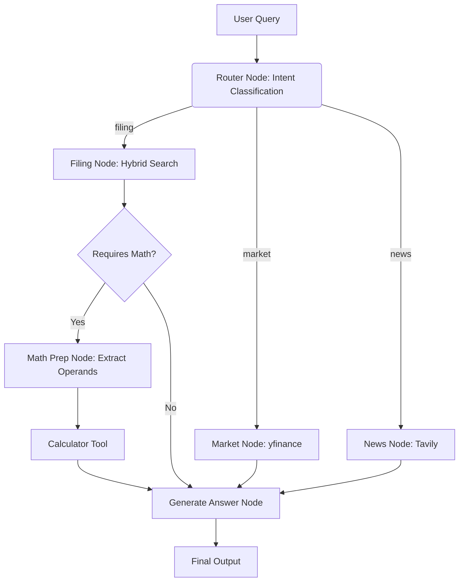

# 📈 Financial Analyst Agent — Tool-Augmented RAG with LangGraph


-red)


## 🎥 Project Demo
> Short demos showcasing retrieval, tool-based computation, and multi-turn reasoning.

### 1) Core Capability: RAG + Precision Math (Tool-Enforced)
**Scenario:** Query Apple’s 2024 Form 10-K (retrieval), then do a forward-looking projection based on retrieved net sales.

▶️ Demo:
https://github.com/denis7-jean/Financial-Analyst-Agent-RAG-LangGraph/releases/download/v1.0/demo_rag_calculation.mp4

### 2) Multi-turn Context: Follow-up Without Re-retrieval
**Scenario:** Compare the projected net sales against Apple’s 2023 historical data using prior context.

▶️ Demo:
https://github.com/denis7-jean/Financial-Analyst-Agent-RAG-LangGraph/releases/download/v1.0/demo_multiturn_comparison.mp4
---

### 3) Cross-Domain Tool Synergies (RAG + Web + Math)
**Scenario:** The user queries Apple’s 2024 Form 10-K for net sales, requests current stock prices from live markets, and asks for a custom ratio calculation.
The agent seamlessly transitions across three tools: extracting accurate 10-K figures via Hybrid RAG, fetching real-time market data via `yfinance`, and computing the ratio via a deterministic `calculator` tool without mental math hallucinations.

### 4) Traceability & Artifact Debugging
**Scenario:** Inspecting the underlying data pipeline.
The project includes a dedicated `eval_ui.py` Streamlit dashboard to visually trace parsed HTML tables, chunk metadata (page/section), and Hybrid Search (Dense + Sparse) fusion scores.

## 📖 Project Overview
This project is an advanced **Agentic RAG System** designed to perform autonomous analysis of financial documents (SEC 10-K filings). 

Unlike traditional RAG pipelines that simply retrieve flattened text, this system uses **Hi-Res Document Parsing** to keep financial tables intact, orchestrates a **Hybrid Retrieval** engine, and uses **LangGraph** to power a state-machine workflow. The agent dynamically routes between RAG, real-time web search, and python-based deterministic math evaluation.

### 🎯 Objective
To solve the "hallucination" and "math" problems in financial LLM applications by decoupling **retrieval**, **reasoning**, and **calculation**, while ensuring 100% citation traceability.

## 🧠 Architectural Evolution: From ReAct to Explicit Routing
Initially built using a standard ReAct loop (where the LLM freely decides when/if to call tools), the agent struggled with implicit questions and often hallucinated math or fell back to conversational clarification. 

To achieve production-grade reliability, the architecture was upgraded from **Soft Constraints (Prompt Engineering)** to **Hard Constraints (Graph Edges)**:
* **Explicit Router:** A structured output node categorizes the query, forcing the agent down a specialized execution path (Filing, Market, or News).
* **Math Prep Pipeline:** By decoupling extraction (`math_prep_node`) from computation (`calculator_node`), the agent is strictly prohibited from performing "mental math", completely eliminating arithmetic hallucinations.



## ✨ Key Features & Technical Capabilities

### 1. Table-Aware RAG Engineering

* **Hi-Res Parsing:** Uses `unstructured` to parse complex PDFs, extracting financial tables as intact HTML/Markdown instead of fragmented text.
* **Rich Metadata:** Every chunk retains `page`, `section`, and `parent_id` for accurate LLM citations.
* **Batch Embedding:** Implements safe batching strategies to securely bypass API token limits during ingestion.

### 2. Hybrid Retrieval Engine (Dense + Sparse)

* **Ensemble Retriever:** Combines `ChromaDB` (Semantic Vector Search) with `Rank-BM25` (Keyword Sparse Search).
* **Precision on Finance:** Easily catches exact numerical matches and specific financial terminology (e.g., "$201,183 million") that pure vector search often misses.

### 3. LangGraph Agent Workflow

* **Multi-Tool Orchestration:** Powered by Google's `gemini-2.0-flash`.
* **State Management:** Passes explicit intermediate variables (like `math_operands` and `math_expression`) through the graph state to guarantee reliable end-to-end execution.

## 📊 LLMOps & Evaluation (LangSmith)

This project utilizes **LangSmith** for full-lifecycle observability. We created a baseline dataset based on the Apple 10-K to quantitatively test the agent's RAG and reasoning capabilities.

### Interpreting the Traces: Beyond "Exact Match"

Our LangSmith evaluation revealed profound insights into the limits and capabilities of LLM Agents:

1. **The Flaw of Exact Match:** The evaluator scored `0.00` on Exact Match because the agent naturally adds units, scale conversions (e.g., "billion"), and perfect document citations. This highlights why LLM-as-a-Judge is preferred for Agent evaluation over rigid string-matching.
2. **Routing Success:** Traces proved the Explicit Router successfully cured the agent of conversational loops. Instead of asking "Which year?", it correctly routed implicit questions directly to the 10-K filing tools.
3. **The RAG Physical Limit (Future Work):** While the math calculation flow is perfectly rigid, extracting specific multi-year figures from complex SEC tables occasionally resulted in row/column misalignment. This demonstrates the physical ceiling of text-based RAG on dense tables, paving the way for our next evolution: **Text2SQL** or **Vision-Language Models (GraphRAG/Multimodal parsing)** for 100% structured data extraction.

## 🛠️ Tech Stack

* **Orchestration:** LangChain, LangGraph
* **LLM:** Google `gemini-2.0-flash`
* **Embeddings:** Google `text-embedding-004`
* **Vector DB & Retrieval:** ChromaDB (Dense) + Rank-BM25 (Sparse)
* **Document Parsing:** `unstructured` (with Tesseract OCR & Poppler)
* **Agent Tools:** `yfinance`, `tavily-python`, `numexpr`
* **Observability:** LangSmith
* **Frontend:** Streamlit

## 📂 Project Structure

```bash
├── data/                   # Raw 10-K PDFs
├── vector_db/              # Persisted ChromaDB and parsed artifacts (JSONL)
├── src/
│   ├── config.py           # Centralized environment configurations
│   ├── ingestion/          # Table-aware PDF parsing and batch embedding
│   ├── retrieval/          # ChromaDB + BM25 Hybrid Ensemble Retriever
│   ├── graph/              # LangGraph nodes, routing, and state definition
│   ├── tools/              # search_10k, yfinance_tool, calculator, web_search
│   └── evaluation/         # LangSmith dataset creation and evaluation scripts
├── app.py                  # Main Streamlit UI (Chat Agent)
├── eval_ui.py              # Debug UI for Artifact tracing & Retrieval evaluation
├── requirements.txt
├── Dockerfile              # Cloud Run ready containerization (with OS-level dependencies)
└── README.md

```

## 🚀 Getting Started

### 1. Environment Setup

Create a Python 3.10+ virtual environment (Conda recommended):

```bash
conda create -n financial_agent python=3.10
conda activate financial_agent
pip install -r requirements.txt

```

### 2. Configuration

Create a `.env` file in the project root:

```env
GOOGLE_API_KEY=AIzaSy...
TAVILY_API_KEY=tvly-...
GEMINI_MODEL=gemini-2.0-flash

# For Observability (Optional but Recommended)
LANGCHAIN_TRACING_V2=true
LANGCHAIN_ENDPOINT="[https://api.smith.langchain.com](https://api.smith.langchain.com)"
LANGCHAIN_API_KEY=lsv2_...
LANGCHAIN_PROJECT="Financial-Analyst-Agent"

```

### 3. Run the Pipeline

Parse the 10-K, extract tables, and build the hybrid vector database:

```bash
python -m src.ingestion.ingest

```

### 4. Trace & Evaluate

Run the LangSmith automated evaluation script:

```bash
python -m src.evaluation.evaluate_langsmith

```

### 5. Launch the Agent

Chat with the Financial Analyst:

```bash
streamlit run app.py

```

---

*Author: Huiyao Lan — MEng, Data Analytics and Machine Learning*